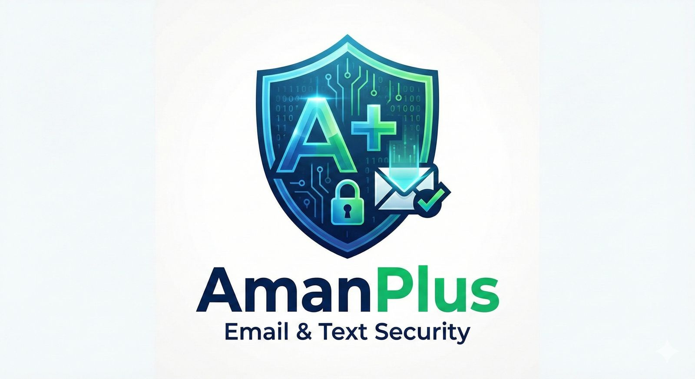

# 🛡️ أمان | Aman v2.0

<p align="center">
  
</p>

> العرض التقديمي: `assets/Aman_Presentation.pptx`

## Project Status & Disclaimer
Aman is a Hackathon MVP / Proof of Concept built under time constraints.  
Not production-ready yet (no full security hardening, testing, or monitoring).  
For demo and educational use only — do not use with sensitive personal/banking data.

---

## 💡 فكرة المشروع (Overview)
**Aman (أمان)** نظام يساعد على حماية المستخدم من الاحتيال المالي عبر **تحليل الرسائل والروابط المشبوهة**.  
يعطيك **Risk Score** مع **سبب مختصر** وتوصية واضحة: *تجاهل / تحقق / احظر*.

## 🧠 كيف يشتغل؟ (How it works)
1) المستخدم ينسخ نص الرسالة أو يرفع سكرينشوت  
2) النظام يستخرج النص + الرابط (إن وجد)  
3) التحليل يتم باستخدام **Rules + Machine Learning (+ AI اختياري)**  
4) النتيجة: **Risk Score + Indicators + Recommendation**

## ⚡ المميزات
- تحليل الرسائل والروابط بسرعة مع **Risk Score**
- كشف أنماط شائعة (OTP / انتحال بنك / انتحال مدير / روابط مشبوهة)
- **Browser Extension** للتجربة داخل المتصفح
- Dataset + Training لرفع الدقة وتقليل الـ false positives

---

## 🚀 تشغيل الباك-إند (Windows PowerShell)

```powershell
cd backend

# إنشاء بيئة
python -m venv .venv
.\.venv\Scripts\Activate.ps1

# تثبيت المكتبات
pip install -r requirements.txt

# تدريب النموذج (مهم)
python train.py

# تشغيل السيرفر
python main.py
```

سيرفر الـAPI:
- `http://127.0.0.1:8000`

---

## 🧩 تشغيل الإكستنشن (Chrome)
1) افتح:
- `chrome://extensions`

2) فعّل **Developer mode** ثم **Load unpacked** واختر:
- `extension/`

3) افتح Gmail (أو أعد تحميل الصفحة) وجرّب تفتح أي رسالة.

> ملاحظة: إذا ما عندك مفتاح Groq، النظام يشتغل بدون AI (Rules + ML فقط). لتفعيل AI ضع:
> `GROQ_API_KEY=...`

---

## 🧪 اختبار سريع
| الرسالة | النتيجة المتوقعة |
|---------|-----------------|
| "انا من بنك التنمية ارسلي رقم ال otp" | 🔴 80%+ |
| "انا مديرك ابغى الرقم السري" | 🔴 90%+ |
| "تم إيقاف بطاقتك: bank.xyz" | 🔴 85%+ |
| "اجتماع الفريق غداً الساعة 10" | 🟢 10-20% |

---

## 📡 API Endpoints
| Endpoint | الوصف |
|----------|-------|
| GET `/` | الصفحة الرئيسية |
| POST `/analyze` | تحليل رسالة |
| GET `/stats` | الإحصائيات |
| GET `/model/status` | حالة النموذج |

---

## 📁 هيكل المشروع
```text
.
├── backend/
│   ├── main.py
│   ├── train.py
│   ├── rules.py
│   ├── requirements.txt
│   ├── data/
│   │   └── training_data.csv
│   └── models/
└── extension/
```

---

## 📚 توثيق إضافي
- تفاصيل تعلم الآلة + تحسين الدقة: `docs/ML_NOTES.md`

---

## Roadmap (Next)
- Improve model evaluation & reduce false positives
- Add unit/integration tests
- Security hardening + rate limiting + logging/monitoring
- Better UI/UX for the browser extension

---

**Jadah Thon 2025** 🚀
